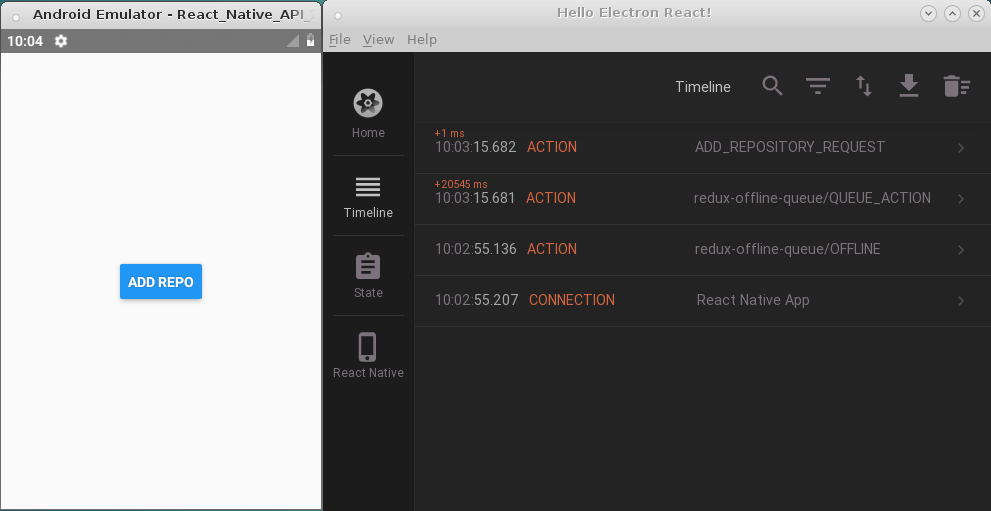
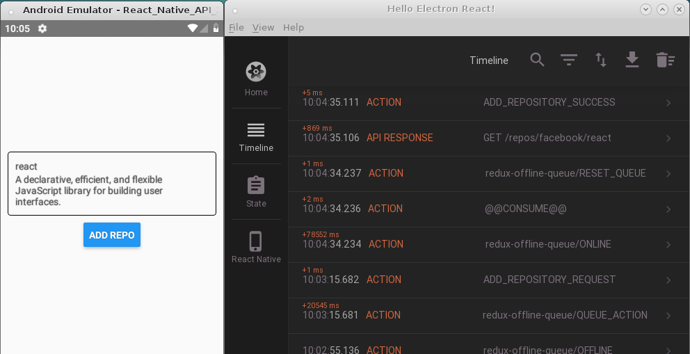

# Stock Row with Redux Saga #

Offline action queue with Redux Saga in React Native

* Author: [Francis Rodrigues][1]
* Video tutorial: [Rocketseat on Youtube [BR]][2]

## What does it do ##

Adds some offline application actions in a queue until the device connects to the internet and begins processing these actions in order, such as a queue.

## Screenshots ##

Click action on the button without internet.



After connecting the device, the actions began to be processed.



## Get started ##

Download / clone the repository and install the dependencies. After that you can start the local console.

```bash
~$ npm i && npm start

> @ start /home/paneladm/projects/react-native-apps/stock-row-redux-saga
> node ./node_modules/react-native/local-cli/cli.js start

┌──────────────────────────────────────────────────────────────────────────────┐
│                                                                              │
│  Running Metro Bundler on port 8081.                                         │
│                                                                              │
│  Keep Metro running while developing on any JS projects. Feel free to        │
│  close this tab and run your own Metro instance if you prefer.               │
│                                                                              │
│  https://github.com/facebook/react-native                                    │
│                                                                              │
└──────────────────────────────────────────────────────────────────────────────┘

Looking for JS files in
   /home/paneladm/projects/react-native-apps/stock-row-redux-saga

Loading dependency graph...
Loading dependency graph, done.

```

* Open the `reactotron` debug app before running your application.
* Open `http://localhost:8081/debugger-ui/` on Google Chrome with `Console` tab opened.
* Run your application on Android / iOS, as you prefer.

```bash
~$ npm run android


> @ android /home/paneladm/projects/react-native-apps/stock-row-redux-saga
> react-native run-android

JS server already running.
Building and installing the app on the device (cd android && ./gradlew installDebug)...

> Task :app:installDebug
Installing APK 'app-debug.apk' on 'React_Native_API_28(AVD) - 9' for app:debug
Installed on 1 device.


BUILD SUCCESSFUL in 1m 19s
27 actionable tasks: 1 executed, 26 up-to-date
Running /home/paneladm/Android-sdk/platform-tools/adb -s emulator-5554 reverse tcp:8081 tcp:8081
Starting the app on emulator-5554 (/home/paneladm/Android-sdk/platform-tools/adb -s emulator-5554 shell am start -n com.stockrowreduxsaga/com.stockrowreduxsaga.MainActivity)...
Starting: Intent { cmp=com.stockrowreduxsaga/.MainActivity }
```

## References ##

* [Simple offline queue for Redux][3]
* Redux Saga - [An alternative side effect model for Redux apps][4]
* Redux Sauce - [Some aesthetic toppings for your Redux meal][5]
* Reactotron - [A desktop app for inspecting your ReactJS and React Native projects][6]

## License ##

MIT

  [1]: https://github.com/francisrod01
  [2]: https://www.youtube.com/watch?v=hs3N1pYSgig
  [3]: https://github.com/InspireNL/redux-offline-queue
  [4]: https://github.com/redux-saga/redux-saga
  [5]: https://github.com/infinitered/reduxsauce
  [6]: https://github.com/infinitered/reactotron
